# Universal-description-of-the-NS-surface-using-ML
* Neutron stars provide an ideal theoretical framework for exploring fundamental physics when nuclear matter surpasses densities encountered within atomic nuclei. Despite their paramount importance, uncertainties in the equation of state (EoS) have shrouded their internal structure. The star's shape morphology is contingent upon the EoS and the rotational dynamics. This work proposes new universal relations regarding the star's surface, employing advanced machine-learning techniques for regression. More specifically, we developed highly accurate universal relations for a neutron star's eccentricity, the star's ratio of the polar to the equatorial radius, and the effective gravitational acceleration at both the pole and the equator. Furthermore, we proposed a precise theoretical formula for $(d\log R(\mu)/d\theta)_{\max}$. This research addresses key astronomical aspects by utilizing these global parameters as features for the neural network training phase. Along the way, new effective parameterizations for each star's global surface characteristics have been introduced. The evaluated regression methodology enabled precise estimations of the star's surface $R(\mu)$, its corresponding logarithmic derivative $d\log R(\mu)/d\theta$, and its effective acceleration due to gravity $g(\mu)$ with accuracy better than $1 \%$. Thus, offering an adequate formulation that transcends the EoS dependencies. In addition, this study aligns with the burgeoning field of multimessenger astronomy, contributing to recent advancements in gravitational wave astronomy by incorporating machine learning methodologies. The analysis is performed for an extended sample of rotating configurations constructed using a complete ensemble of 70 tabulated hadronic, hyperonic, and hybrid EoS models that obey the multimessenger constraints and cover a wide range of stiffnesses. Above all, the suggested relations could provide an accurate framework for the star's surface estimation using data acquired from the NICER X-ray telescope or future missions, and constrain the EoS of nuclear matter when measurements of the relevant observables become available.

# Effective universal normalization for the star's surface
<div style="text-align: center;">
  <table>
    <tr>
      <td>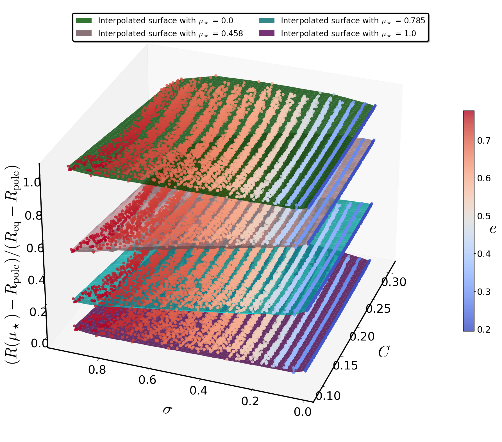</td>
      <td>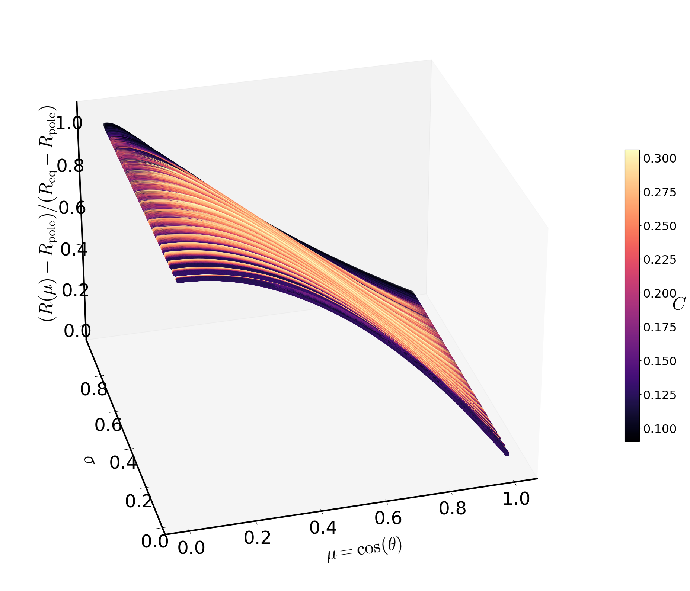</td>
    </tr>
  </table>
</div>


<div style="text-align: center;">
  <table>
    <tr>
      <td></td>
      <td></td>
      <td>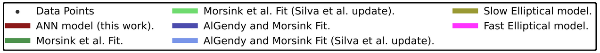</td>
      <td>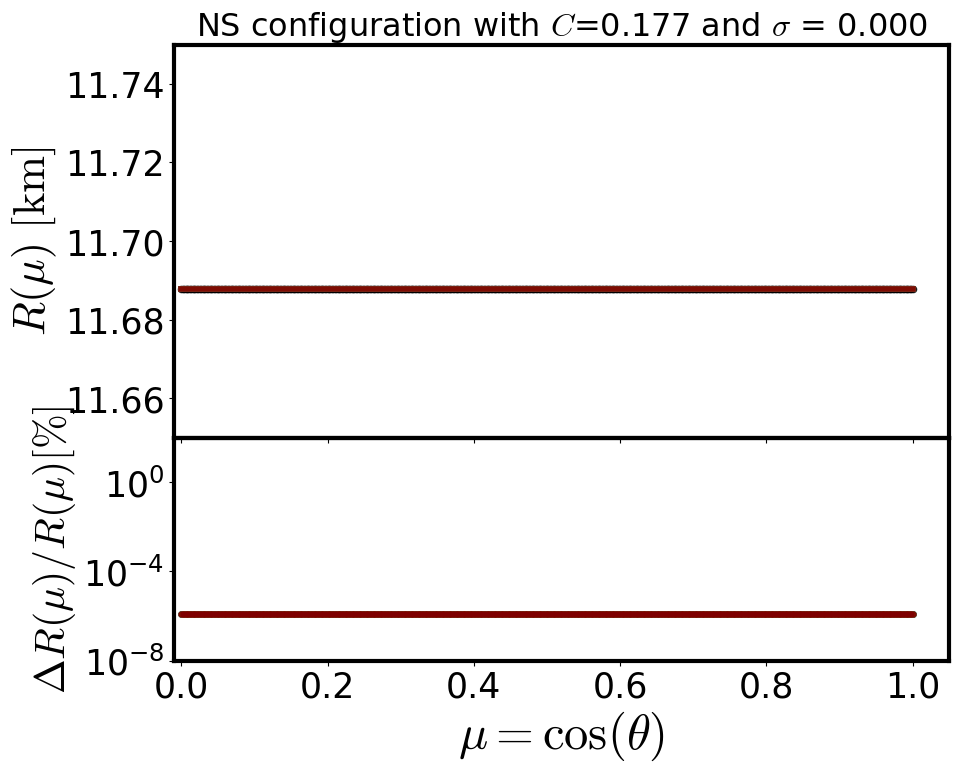</td>
    </tr>
    <tr>
      <td>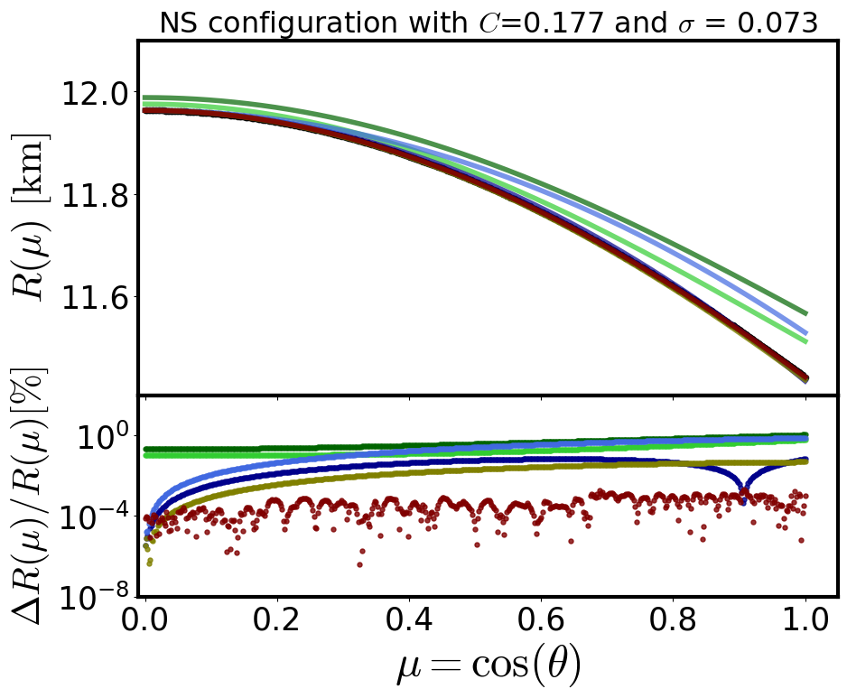</td>
      <td>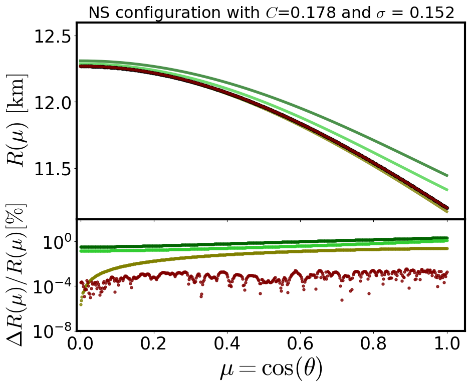</td>
      <td>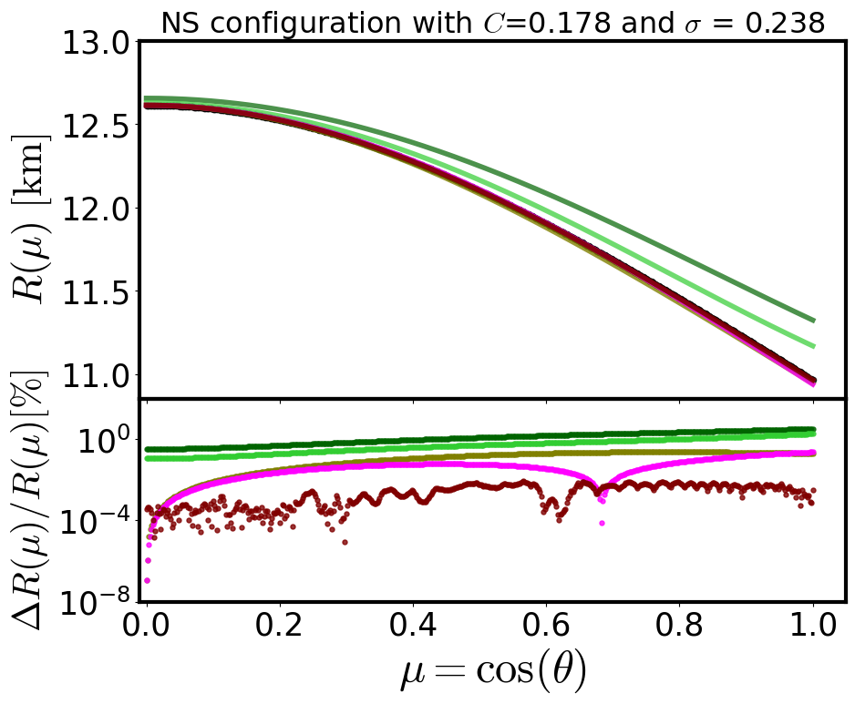</td>
      <td>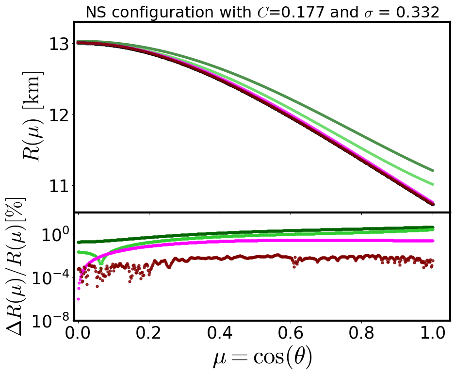</td>
    </tr>
    <tr>
      <td>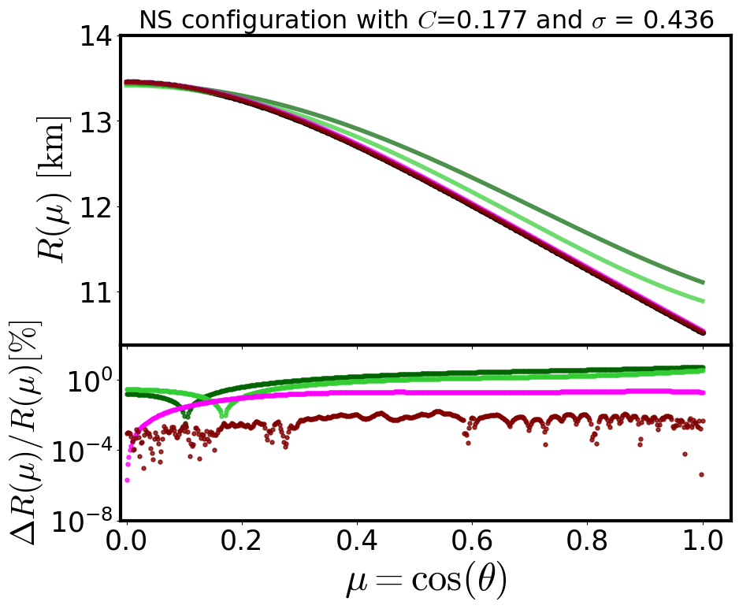</td>
      <td>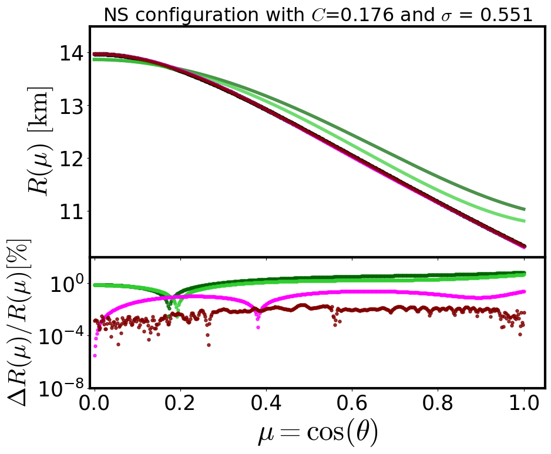</td>
      <td>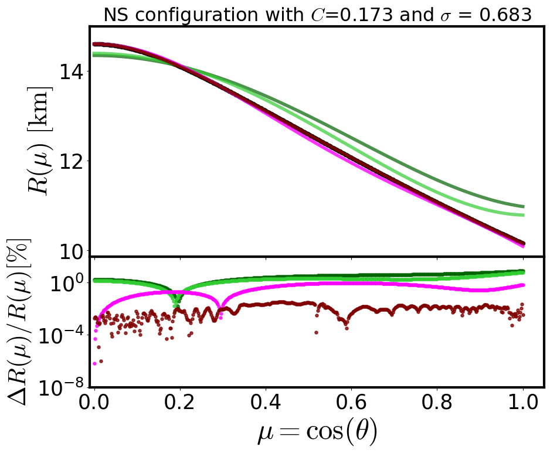</td>
      <td>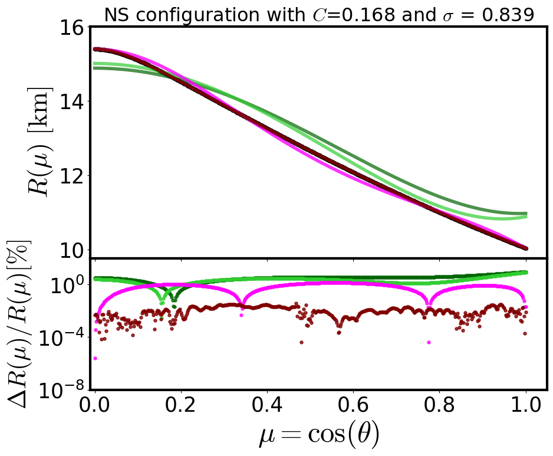</td>
    </tr>
  </table>
</div>

# Repository Overview
This repository contains the model architecture, pre-trained model weights, and example demos that demonstrate the usage of our code for predicting neutron star surface properties using machine learning.

# Contents
* **Model Architecture**: The machine learning models developed for the regression tasks.
* **Pre-trained Weights**: Ready-to-use model weights for reproducing our results.
* **Demos**: Sample scripts illustrating how to load the models and perform predictions on new data.

# Installation
To set up the necessary environment for running the code, ensure the following dependencies are installed:

```bash
pip install numpy pandas scikit-learn torch
```

# Dependencies
* `numpy`
* `pandas`
* `sklearn`
* `pytorch`

# Usage
1. **Loading the Pre-trained Model**: You can load the provided pre-trained model weights and use them to predict surface parameters of neutron stars. Check the demos folder for example usage.
```python
import torch
model = torch.load('path_to_model_weights.pth')
```
2. **Running a Demo**: Example demo scripts can be found in the ... directory. These scripts demonstrate how to predict neutron star properties, such as eccentricity and gravitational acceleration.

# Contact
For any questions, data access, or further collaborations, feel free to contact us via email at ....

# Citation
If you find this work useful in your research, please cite our paper: ...

